# JavaScript Syntax

Mọi thứ trong JavaScript bao gồm các biến, tên hàm, tên lớp và toán tử đều phân biệt chữ hoa chữ thường.

Ví dụ total và Total là 2 biến khác nhau

### Định danh

Một định danh là tên của một biến, hàm, tham số hoặc lớp. Mã định danh bao gồm một hoặc nhiều ký tự theo định dạng sau:

- Ký tự đầu tiên phải là một chữ cái (a-z hoặc A-Z), dấu gạch dưới (\_) hoặc ký hiệu đô la ($).

- Các ký tự khác có thể là chữ cái (a-z, A-Z), số (0-9), dấu gạch dưới (\_) và ký hiệu đô la ($).

Tên được đặt theo kiểu camel case là rất tốt. Chữ cái đầu viết thường và từ thứ hai trở đi viết hoa chữ cái đầu

Ví dụ : countNumber , totalMonney , newArray.....

### Keywords

JavaScript định nghĩa một danh sách các từ khóa có công dụng đặc biệt.

Bạn không thể sử dụng các từ khóa phía dưới làm định danh. Danh sách các từ khóa JavaScript hoàn chỉnh như sau

- break, export, super, case, extends, switch
- catch, finally, typeof, class, for, this, const, function, throw
- continue, if, try, debugger, import, var, default, in, void
- delete, instanceof, while,
- do, new, with, else, return, yield

# ES6

### Let

JavaScript let được sử dụng để khai báo các biến. Trước đây, các biến được khai báo bằng câu lệnh var.

Các biến được khai báo bằng let là block-scoped. Điều này có nghĩa là chúng chỉ có thể truy cập được trong một khối cụ thể.
Ví dụ

`let name = "Dat"`
{
`let name = Hung`
`console.log(name)` `//Hung`
}
`console.log(name) // Dat`

### Const

Câu lệnh const được sử dụng để khai báo hằng số trong JavaScript. Ví dụ:

`name = "Dat"`

Sau khi khai báo, bạn không thể thay đổi giá trị của biến const.

### Arrow Function

Trong phiên bản ES6, bạn có thể sử dụng các Arrow Function (hàm mũi tên) để tạo biểu thức hàm. Ví dụ:

Cú pháp của ES5
`let x = function (x,y) {return x * y}`

Viết bằng Arrow Function:
`let x = (x, y) => x * y;`

# Default Parameters

Trong phiên bản ES6, bạn có thể truyền các giá trị mặc định trong đối số của hàm. Ví dụ,

`function sum (x,y=5) {console.log(x+y)}`
`sum(5);//10`
`sum(5,15);//20`

Trong ví dụ trên, nếu bạn không truyền tham số cho y, nó sẽ lấy giá trị 5 theo mặc định.

# Template Literals

Template Literals hay còn gọi là Template Strings là một cú pháp mới để khai báo String trong JavaScript được giới thiệu trong ES2015/ES6. Nó cho phép chúng ta sử dụng multi-line string, biến, biểu thức, hàm bên trong String mà không phải thông qua phép cộng String.

Cú pháp của ES5
`let first_name = "Jack"`
`let last_name = "Sparrow"`
`console.log('Hello ' + first_name + ' ' + last_name);`

Cú pháp của ES6
`let first_name = "Jack"`
`let last_name = "Sparrow"`
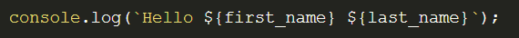

# Destructuring

Destructuring là một cú pháp cho phép bạn gán các thuộc tính của một Object hoặc một Array. Điều này có thể làm giảm đáng kể các dòng mã cần thiết để thao tác dữ liệu trong các cấu trúc này.

Cú pháp của ES5
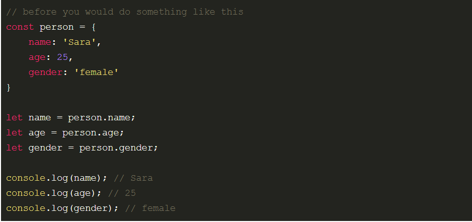

Sử dụng cú pháp Destructuring trong ES6, đoạn mã trên có thể được viết như sau:
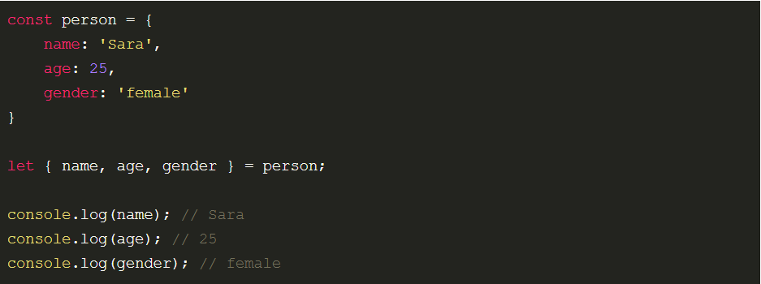

# Import và Export

Bạn có thể export một hàm hoặc một chương trình và sử dụng nó trong một chương trình khác bằng cách import nó. Điều này giúp tạo ra các thành phần có thể tái sử dụng. Ví dụ: nếu bạn có hai tệp JavaScript có tên contact.js và home.js.

Trong tệp contact.js, bạn có thể export hàm contact():

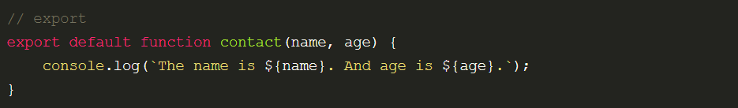

Sau đó, khi bạn muốn sử dụng hàm contact() trong một tệp khác, bạn chỉ cần import hàm. Ví dụ trong tệp home.js:

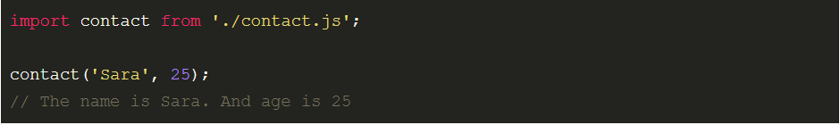

# Promises

Promises thường được sử dụng để xử lý bất đồng bộ. Ví dụ:

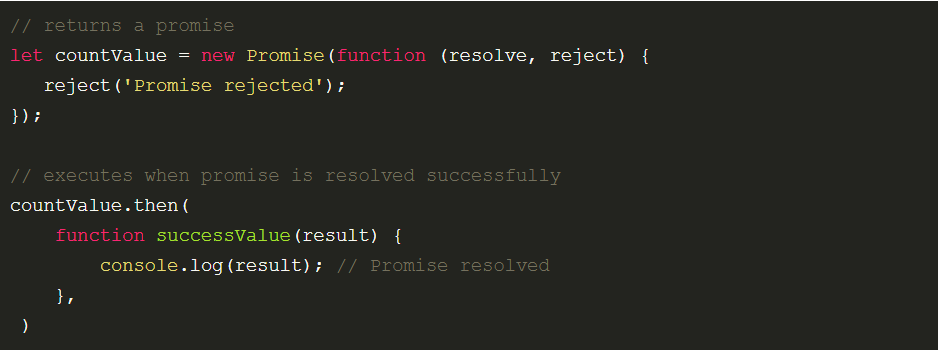

# Rest Parameter và Spread Operator

Bạn có thể sử dụng Rest Parameter để biểu diễn số lượng đối số không xác định dưới dạng một mảng. Ví dụ:

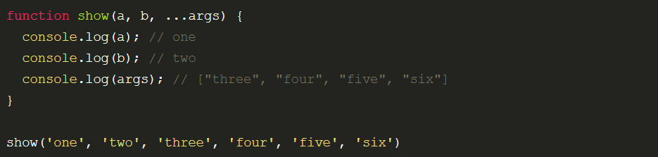

Bạn có thể truyền các đối số còn lại bằng cú pháp `...`với tham số là args.

Bạn sử dụng Spread Operator ... để sao chép các phần tử vào một mảng duy nhất. Ví dụ:

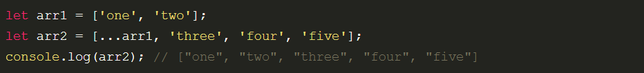

Cả 2 Rest Parameter và Spread Operator đều sử dụng cùng một cú pháp. Tuy nhiên, Spread Operator được sử dụng với mảng (giá trị có thể lặp lại).

# Scope

Trong Javascript, scope hay phạm vi truy cập, đề cập đến ngữ cảnh của đoạn code. Scope có thể định nghĩa là toàn cục (globally) hoặc cục bộ (locally). Nắm rõ scope trong Javascrip là chía khóa để viết những đoạn code rõ ràng, sạch sẽ, hiểu được các biến/hàm này có thể truy cập đến không hay giúp cho đoạn code của bạn dễ manitain, dễ debug hơn.

### Global Scope

Trước khi bắt đầu viết một dòng code, chúng ta đang nằm trong cái mà được gọi là phạm vi truy cập toàn cục(global scope). Nếu ta định nghĩa biến, biến đó là toàn cục . Ví dụ

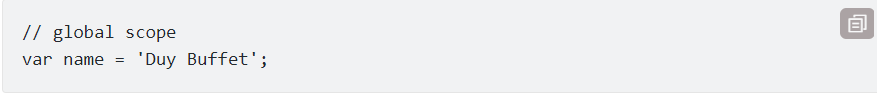
(var có thuộc tính global scope)

### Local scope

Local scope đề cập tới bất kỳ scope nào được xác định qua global scope. Thường có một phạm vi truy cập toàn cục (global scope) duy nhất và mối function lại định nghĩa phạm vi truy cập cục bộ (local scope) của riêng nó. Nếu định nghĩa một function và tạo các biến bên trong nó, các biến này được gọi là biến cục bộ. Ví dụ:

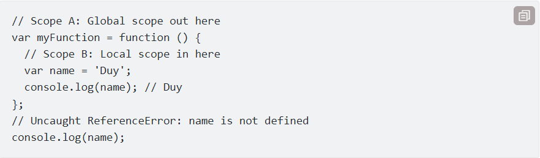

Biến `name` có phạm vi truy cập là `local scope` và nó sẽ không thể được truy cập bởi scope cha, do đó dẫn đến kết quả là `undefined`

# Event Handler

Dùng thuộc tính `EventHandler` có sẵn của `object` để "bắt sự kiện".

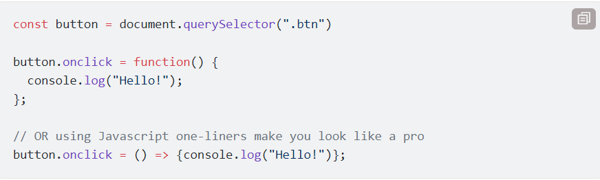

Trong ví dụ này, thuộc tính `onclick` được sử dụng để khi người dùng nhấp vào button, nó sẽ in ra dòng chữ "Xin chào!" vào console log.

# Async / Await

- Async / Await là một tính năng của JavaScript giúp chúng ta làm việc với các hàm bất đồng bộ theo cách thú vị hơn và dễ hiểu hơn. Nó được xây dựng trên Promises và tương thích với tất cả các Promise dựa trên API. Trong đó:

- Async - khai báo một hàm bất đồng bộ (async function someName()
- Tự động biến đổi một hàm thông thường thành một Promise.
- Khi gọi tới hàm async nó sẽ xử lý mọi thứ và được trả về kết quả trong hàm của nó.
- Async cho phép sử dụng Await.

---

- Await - tạm dừng việc thực hiện các hàm async. (Var result = await someAsyncCall ()😉.
- Khi được đặt trước một Promise, nó sẽ đợi cho đến khi Promise kết thúc và trả về kết quả.
- Await chỉ làm việc với Promises, nó không hoạt động với callbacks.
- Await chỉ có thể được sử dụng bên trong các function async.

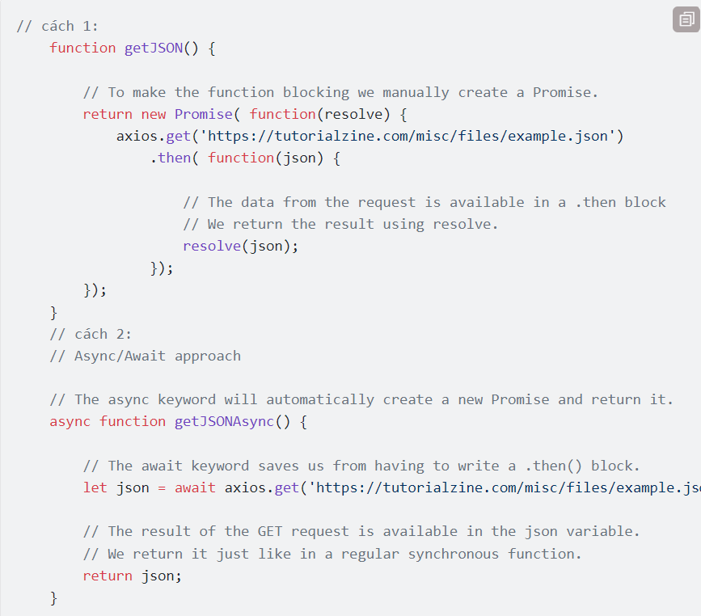

# Promiese

Promise có thể giải quyết được hellcode

### Overview

Một object `Promise` đại diện cho một giá trị ở thời điểm hiện tại có thể chưa tồn tại, nhưng sẽ được xử lý và có giá trị vào một thời gian nào đó trong tương lai. Việc này sẽ giúp bạn viết các dòng code xử lý không đồng bộ trông có vẻ đồng bộ hơn. Lấy ví dụ, nếu bạn sử dụng Promise cho việc gọi API để lấy dữ liệu, bạn sẽ tạo ra một đối tượng Promise đại diện cho data lấy được từ API. Điều cốt lõi ở đây là dữ liệu sẽ chưa tồn tại ở thời điểm đối tượng `Promise` được tạo ra, mà chỉ có thể truy cập sau khi có response từ web service. Trong thời gian chờ lấy dữ liệu, `Promise` object sẽ đóng vai trò như một proxy cho dữ liệu. Hơn nữa, bạn có thể đính các callback vào `Promise` object để thực hiện việc xử lý dữ liệu. Các callback này sẽ chỉ thực hiện khi dữ liệu đã sẵn sàng.

### Promise API

Chúng ta khởi tạo đối tượng `Promise`

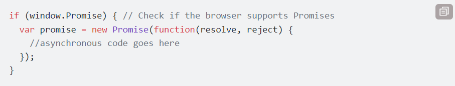

Hàm callback này sẽ nhận 2 tham số là `resolve` và `reject`, với cả 2 tham số đều có kiểu là hàm (function). Tất cả các code bất đồng bộ sẽ nằm trong hàm callback này. Nếu mọi thứ thành công, `Promise` sẽ được hoàn thành và hàm `resolve` sẽ được gọi. Trong trường hợp có lỗi, hàm `rejec`t sẽ được gọi với một đối tượng `Error`, nhằm xác định rằng Promise này đã bị không thành công.

Khi chúng ta khởi tạo một đối tượng `Promise`, chúng ta có một proxy đến dữ liệu sẽ sẵn sàng sử dụng trong tương lai. Trong trường hợp cụ thể ở trên, chúng ta hy vọng rằng dữ liệu sẽ được truyền về từ phía web service vào một thời điểm nào đó. Vậy làm thế nào để chúng ta biết rằng khi nào thì dữ liệu sẽ sẵn sàng cho việc sử dụng? Đây là việc mà `Promise.then()` sẽ giải quyết cho chúng ta. Hàm then sẽ dùng 2 tham số với ý nghĩa: một callback thành công và một callback thất bại. Các callback này sẽ được gọi khi `Promise` được xử lý xong xuôi (thành công hay thất bại). Nếu `Promise` được xử lý trơn tru, callback thành công sẽ được gọi với dữ liệu truyền vào hàm `resolve()`. Nếu promise gặp lỗi, callback thất bại được goi. Bất kể thứ gì bạn truyền vào `reject()` sẽ được truyền như mội tham số đến callback này.

Lưu ý rằng một promise sẽ có 3 trạng thái :

- Pending (đang xử lý)
- Fulfilled (đã hoàn thành)
- Rejected (đã bị từ chối)

### Xử lý lỗi

Trước đó tôi đã giới thiệu hàm `then()` sẽ nhận 2 hàm callbacks làm tham số. Hàm callback thứ 2 sẽ được gọi khi `Promise` bị từ chối. Tuy nhiên chúng ta cũng có một cách khác, sử dụng một hàm tên là `catch()`, chúng ta có thể xử lý khi `Promise` bị từ chối. Đoạn code dưới đây mô tả việc sử dụng hàm `catch()`:

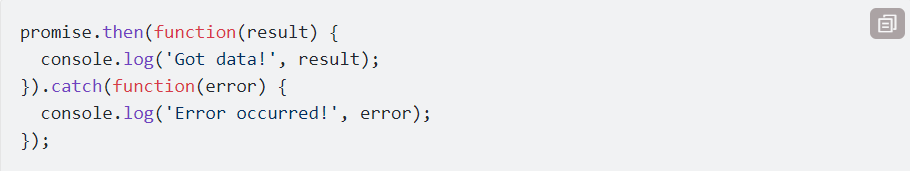

Đoạn ở trên tương đương với :
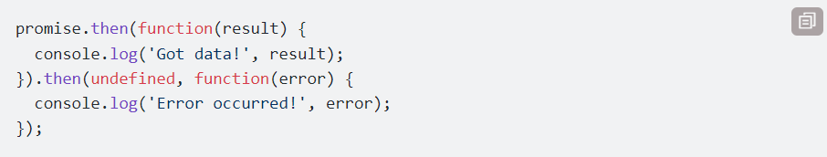

Lưu ý rằng nếu `Promise` bị từ chối và hàm `then()` không có callback để xử lý việc này, xử lý sẽ được chuyển đến hàm xử lý lỗi của hàm `then(`) tiếp theo hoặc hàm `catch()` tiếp theo. Ngoài việc dùng để xử lý `Promise` bị lỗi, hàm callback trong `catch()` cũng được gọi khi có bất kỳ exception nào được bắn ra từ callback của hàm khởi tạo `Promise`. Vì thế bạn có thể dùng `catch()` cho việc lưu log. Chú ý rằng chúng ta có thể sử dụng try...catch để xử lý lỗi, nhưng điều đó là không cần thiết khi sử dụng `Promise` vì bất kỳ exception nào cũng luôn được xử lý bởi hàm `catch()`.
